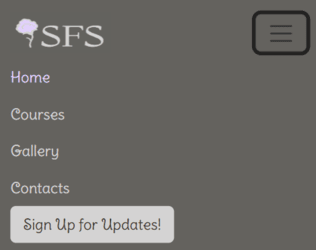
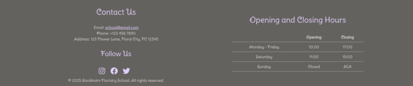
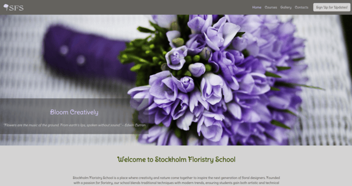
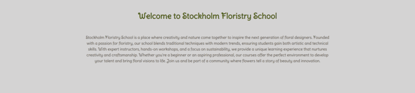
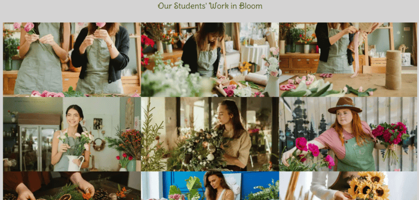
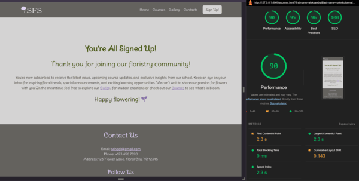

# **Stockholm Floristry School**


[View live project here!](https://alexdotrud.github.io/floristry_school_project/)

Welcome to the Floristry School Website, a demo project created to showcase the design and functionality of a floristry school platform.
This is a fictional website designed for educational and portfolio purposes. It serves as an example of how a floristry school website could be structured, offering information about courses, student works, and sign-up options for updates.

## Content:
- [User Goals](#user-goals)  
- [Business Goals](#business-goals)  
- [Developer Goals](#developer-goals)  
- [User Stories](#user-stories)  
- [Design Choices](#design-choices)  
- [Features](#features)  
- [UX Design](#ux-design)  
- [Technologies Used](#technologies-used)  
- [Testing](#testing)  
- [Bugs](#bugs)  
- [Deployment](#deployment)  
- [Publishing](#publishing)  
- [Credits](#credits)  


## User Goals
The website is designed to provide an engaging and informative experience for users who are passionate about floristry. 
#### Users should be able to:

- Explore educational possibilities by checking information about courses and programs on Home page.
- Explore floral arrangements created by students on Gallery Page.
- Sign up to receive updates about upcoming courses, events, and news.
- Navigate the website easily with a visually appealing and user-friendly design.

## Business Goals
This project simulates the online presence of a floristry school, focusing on key business objectives:

- Attract Potential Students – Provide an engaging platform that encourages users to explore courses and sign up for updates.
- Showcase Student Work – Build credibility and inspire future students by displaying high-quality floral arrangements.
- Improve Lead Generation – Use the sign-up feature to simulate how a real business would collect user interest and expand its audience.

## Developer Goals
This project serves as an opportunity to demonstrate web development skills and improve technical expertise:

- Build a Responsive and User-Friendly Website – Ensure a seamless experience across all devices.
- Implement a Functional Sign-Up System – Simulate real-world user interaction by collecting email subscriptions.
- Showcase Frontend Development Skills – Use HTML, CSS, and JavaScript to create an aesthetically pleasing and interactive interface.

## User Stories
- As a visitor (potential student), I can navigate a well-designed Home page, so that I can quickly understand what the school offers and find relevant information.
- As a visitor (potential student), I can browse available classes, so that I can explore different options and choose one that suits my interests.
- As a visitor (potential student), I can see the gallery, so that I can see examples of floral designs created by students and results of the classes.
- As a visitor (potential student), I can sign up for updates, so that I receive notifications about new courses and upcoming programs.
- As a visitor (potential student), I can find a contact section easily, so that I can quickly reach out to the school for inquiries or to reserve a spot in a course.

 ## Design Choices
 
 Wireframes:

- [Home](#home)
- [Gallery](#gallery)
- [Sign Up](#sign-up)
- [Success Page](#success-page)

 ### Home:

### Gallery:


### Sign Up:


### Success Page:


## Features
### Navbar
- Positioned at the top of the page and is fixed for easy navigation.
- Contains the Stockholm Floristry School logo on the left side.
- Navigation links are on the right side, providing quick access to essential pages:

    * Home – Leads to the main page, where users can learn about the floristry school.
    * Courses – Scrolls to the courses section on the home page, showcasing available floristry courses.
    * Gallery – Directs users to the gallery page, where they can explore floral creations by students.
    * Contacts – Scrolls to the contact section on the home page, allowing users to find contact information.
    * Sign Up – A distinct button-styled link that stands out, leading to the sign-up page for new students.




### Footer
- Positioned at the bottom of the page for easy access to contact details and important information.
- Divided into two main sections:
- Contact Information:
    * Displays email, phone number, and physical address of Stockholm Floristry School.
    * Includes social media icons for Instagram, Facebook, and X (Twitter), linking to the school’s social platforms.
    * Copyright notice indicating that all rights are reserved.
- Opening Hours Table:
    * Clearly lists the school’s opening and closing times for each day of the week.
    * Helps users quickly check when they can visit or contact the school.


### Home Page
- Visually appealing design with a clean, floral-inspired aesthetic that aligns with the theme of the floristry school.
- Easy navigation ensures users can quickly explore different sections of the website.
- Responsive layout adapts seamlessly to desktops, tablets, and mobile devices for an optimal browsing experience.
#### Hero Section
- Large, eye-catching banner featuring a beautiful floral arrangement.
- A welcoming headline that conveys the essence of the school.


#### Introduction section
- General information about the floristry school, including its mission and offerings.
- Highlights the school’s approach to teaching, whether through hands-on workshops or comprehensive courses.
- Engages visitors with a warm and inviting tone, encouraging them to explore floristry.


#### Courses section
- Provides a detailed breakdown of the various floristry courses and programs available.
- A  "Sign Up" button is placed for easy access to the Sign-Up Page, encouraging enrollment.


### Gallery Page
- Contain Introduction and Pictire sections.
- A  "Stay Updated On New Courses" button is placed for easy access to the Sign-Up Page, encouraging enrollment.
#### Introduction section
Introduces users to the Gallery Page, giving short discription about pictures.


#### Pictures section
- This section displays a collection of pictures showcasing the students’ work, their creative spaces, and beautiful floral arrangements created during their courses.


### Sign Up Page
#### Sign Up Introduction
- Provides an overview of the benefits of signing up for updates, including information about upcoming courses and school news.


#### Form
- Simple form for users to sign up for updates on upcoming courses and news.
- Fields to collect user information such as name, email, username, and specific areas of interest in floristry.


### Success Page
- Confirmation message displayed after users successfully submit their details via the sign-up form.
- Thanks the user for signing up and confirms that they will receive updates.
- Provides a smooth transition back to the main site, inviting further exploration of courses or gallery.


## UX Design
The UX design of the floristry school website is focused on simplicity, clarity, and accessibility, ensuring a smooth and enjoyable experience for all users. Key design principles include:

### User-Centered Design: 
- The site is tailored to the needs of users, with a clear structure and easy navigation to help them quickly find information and engage with key features.
### Responsive Layout: 
- The website is fully responsive, providing a seamless experience across all devices, from mobile phones to desktops.
### Clear Navigation: 
- A straightforward menu and intuitive layout make it easy for users to explore different sections, such as the Home, Gallery, and Sign-Up pages.
### Visual Design: 
- Floral imagery and a soft, nature-inspired color palette help immerse users in the theme of floristry. Key elements are highlighted with vibrant yet calming colors for a balanced, artistic experience.
### Mobile-First: 
- The design is optimized for mobile devices, ensuring users enjoy a smooth experience on all screen sizes.
Forms & Feedback: The sign-up form is simple and user-friendly, with clear instructions and error messages. A confirmation page reassures users that their submission was successful.

### Color Scheme:
- Primary Color: #43540d (green)
- Secondary Color: #43372e (brown)
- Highlight Color: #866FAC (purple)
- Highlight Color (Light): #D4D3D3 (light grey)


### Fonts:
- Primary Font: "Delius Swash Caps", serif
- Secondary Font: "Delius Swash Caps", sans-serif


## Technologies used

- **HTML** is used to structure the content on the website, including headings, paragraphs, and forms.

- **CSS** is used to style the website, including layouts, colors, fonts, and overall design.

- **CSS Flexbox** is used for creating responsive layouts by aligning and distributing elements within a container.

- **Bootstrap** is used for quick and responsive design with pre-built components like navigation bars and buttons.

- **JavaScript** is used for navbar.

- **Git** is used for version control, allowing tracking of code changes and collaboration with team members.

- **GitHub** is used to host the project’s repository and deploy the website through GitHub Pages.

- **Font Awesome** is used to add scalable vector icons to the website for better user interaction.

- **Google Fonts** is used to enhance typography by integrating stylish fonts into the website.

- **Visual Studio Code** is used as the code editor for writing and managing the website's source code.

## Testing 
### Manual testing results:

| **Test Category**               | **Test Description**                                                       | **Result** | **Status** |
|----------------------------------|---------------------------------------------------------------------------|------------|------------|
| **Functionality Testing**        | Links, buttons, and form inputs work.                                     | Pass       | ✅         |
|                                  | Sign-Up form collects data and redirects to Success Page.                 | Pass       | ✅         |
|                                  | Gallery Page displays images and content.                                 | Pass       | ✅         |
| **Responsive Design Testing**    | Website adjusts layout on all screen sizes.                               | Pass       | ✅         |
|                                  | Content, images, and forms work on all devices.                           | Pass       | ✅         |
| **Navigation Testing**           | Navigation menu is accessible and works on all pages.                     | Pass       | ✅         |
|                                  | All pages are linked properly.                                            | Pass       | ✅         |
| **Accessibility Testing**        | Text color contrasts for readability.                                     | Pass       | ✅         |
|                                  | Compatible with screen readers.                                           | Pass       | ✅         |
|                                  | All interactive elements are keyboard navigable.                          | Pass       | ✅         |
| **Form Testing**                 | Form fields accept user input correctly.                                  | Pass       | ✅         |
|                                  | Form validation works as expected (e.g., required fields).                | Pass       | ✅         |
|                                  | Form submits correctly and redirects to Success Page.                     | Pass       | ✅         |
|                                  | Form can only be submitted if all text fields are filled and one radio button is selected. | Pass | ✅         |
|                                  | Displays "Please fill out this field" for empty text fields.             | Pass       | ✅         |
|                                  | Displays "Please select one of these options" for missing radio button selection. | Pass | ✅         |


#### Lighthouse Report:
- **Home page:**

  

- **Gallery Page:**

  

- **Sign Up Page:**

  

- **Success Page:**

  

## Bugs

### Solved bugs

- **Bootstrap Grid Alignment Issue:** On the Home and Gallery pages, the Bootstrap Grid system caused content within containers to be aligned more to the right. This was corrected by overriding Bootstrap's default margin and padding rules for rows and divs, setting them to 0 for proper alignment.

- **Course Cards Layout Issue:** On screen sizes 1200px and above, course cards were not displaying evenly, with two cards in one row and one in another. The issue was caused by container constraints and was resolved by adjusting grid and column settings to maintain a consistent layout across all screen sizes.

- **Broken Navigation Links on the Gallery Page:** The "Courses" and "Contact" navigation links were not functioning correctly due to missing file paths. This was fixed by adding index.html to the links, ensuring proper navigation.

### Performance Enhancements
- **Optimized Image Loading on the Gallery Page:** Converted images to WebP format for faster loading using Optimize Your Image. Compressed images to reduce file size without compromising quality using tools like TinyPNG and Image Resizer.

- **Google Fonts Optimization:** Implemented preloading and preconnect techniques to enhance font loading speed. Followed best practices from Chrome Developer Guide and ExpertBeacon to minimize render-blocking and improve page performance.
### Unfixed Bugs

- No unfixed bugs found.

### Validator Testing 

#### HTML 

On sign up page use (fieldset) element inside div with radio-buttons and checkboxes - fixed.
No other errors or warnings found.

  - **Inditex.html:** 
  - **Gallery.html:**
  - **Sign-up.html:**
  - **Success.html:**


#### CSS

No errors found
  - **Style.css:**


## Deployment
[Live project can be found here!](https://alexdotrud.github.io/floristry_school_project/)

The project was deployed using GitHub Pages, which allows for easy hosting of static websites directly from a GitHub repository.
 Below are the steps taken to deploy the website.

 ### Steps to Deploy:

#### 1. Push to GitHub Repository:
First, the project files were committed to a GitHub repository. All HTML, CSS, JavaScript, and image files were uploaded and organized within the repository.
#### 2. GitHub Pages Setup:
Once the repository was set up, the GitHub Pages feature was enabled. This is done through the repository's settings.
In the repository’s settings, navigate to the "Pages" section.
Select the main branch (or the branch containing your index.html file) as the source for GitHub Pages.
Choose the root directory as the source if the index.html file is located in the main directory.
#### 3. Accessing the Live Site:
After enabling GitHub Pages, GitHub generates a URL where the project can be viewed live. This URL is shared and accessible by anyone with the link.
The live project can be accessed here: Live Project URL.
#### 4. Continuous Updates:
Any future changes or updates made to the website can be easily deployed by committing changes to the repository, which automatically updates the live site.

## Publishing
We welcome contributions to floristry_school_project! Follow these steps:

### Cloning
1. On GitHub.com, navigate to the main page of the repository.
2. Above the list of files, click Code.
3. Copy the URL for the repository.

 

4. Type git clone in opened terminal, and then paste the URL you copied earlier.
5. Press Enter to create your local clone.

### Forking
1. Fork the repository.  

2. Create a feature branch:  
   ```bash
   git checkout -b feature-name
   ```

3. Make your changes and commit:  
   ```bash
   git commit -m "Add feature description"
   ```

4. Push the last changes and open a pull request:
   ```bash
   git push
   ```


## Credits 

### Content 
- #### Text Content: 
All the content provided on this website is fictional and created for demonstration purposes only.
- #### Images:

1. Picture from Home Page are from- (https://pixabay.com/).
2. Pictures from Gallery Page and picture from Sign Up Page are from - (https://www.pexels.com/).
3. Logo was created on - (https://www.designevo.com/logo-maker/).


### Media
- **Fonts**: The website uses the Delius Swash Caps font, available from Google Fonts.
- **Icons**: Icons used in the site were sourced from FontAwesome (https://fontawesome.com/).
- #### Other tools:

#### Other tools:
1. **Stack Overflow**: Used for troubleshooting and seeking solutions to development challenges (https://stackoverflow.com/).
2. **CodeWithAnbu**: Resource for learning and improving web development techniques (https://codewithanbu.com/).
3. **W3Schools**: Used for reference and tutorials on HTML, CSS, JavaScript, and more (https://www.w3schools.com/).
4. **Chrome DevTools Lighthouse**: Used to test and improve web performance (https://developer.chrome.com/docs/lighthouse/performance/).
5. **ExpertBeacon**: Helped in learning how to optimize Google Fonts loading for better performance (https://expertbeacon.com/the-ultimate-guide-to-preloading-google-fonts-for-optimal-web-performance/).
6. **Schemecolor**: Used to create color scheme (https://www.schemecolor.com/).
7. **Code Institute**: Used for learning web development techniques and improving skills through the full stack developer program (https://www.codeinstitute.net/).
